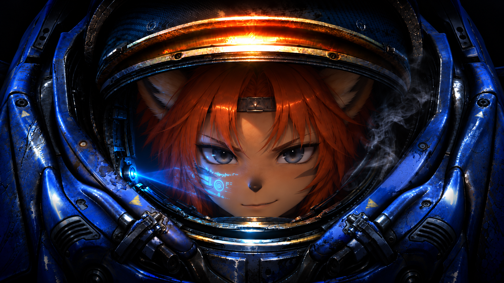

# PoroBotHQ

We build bots and the tools to understand their decisions. Our current focus is **Porotoss**, a Protoss bot for **StarCraft II**, built around an F# policy and a .NET client stack.

## Projects

| Repository | Purpose |
| --- | --- |
| [porotoss](https://github.com/PoroBotHQ/porotoss) | Project coordination, development environments, and workload infrastructure. |
| [porotoss-bot](https://github.com/PoroBotHQ/porotoss-bot) | The bot: game decisions, client integration, tests, and match analysis. |
| [porotoss-engine](https://github.com/PoroBotHQ/porotoss-engine) | Reusable F# contracts for SC2 observations, actions, and queries. |

These development repositories are currently private; their links require collaborator access.

## What we want to understand

- **Economy:** resources collected, worker efficiency, and time lost to poor decisions.
- **Combat:** resources lost when units are destroyed, positioning, and the effects of tech and upgrades.
- **Decisions:** what the bot intended, what it commanded, and what actually happened.
- **The match over time:** traces, maps, and visual analysis that make patterns easier to see.

## How we develop

Changes are reviewed in pull requests and tied to issues. We combine offline checks with actual matches, preserving replays and traces to guide the next improvement.

A completed loss is useful when it shows us what to improve.
